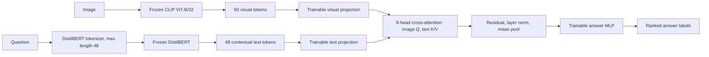

# VQA System: Technical Report

## Abstract

This project implements a visual question answering (VQA) demonstration system using the Flickr30k image-caption dataset. Its primary learned model combines frozen CLIP and DistilBERT encoders with a trainable, multi-head cross-attention fusion module and answer classifier. Unlike pooled-vector fusion, the attention module operates over spatial image tokens and question-token sequences. The final model was trained on 10,000 Flickr30k training images using Apple Metal Performance Shaders (MPS), producing 79,754 caption-derived question-answer examples and 1,275 answer classes.

Flickr30k contains image captions rather than human-authored VQA pairs. Therefore, this work derives deterministic supervision from captions and presents results as a method demonstration, not as a benchmark-level VQA evaluation. For a live demo, the Streamlit application routes open-ended description questions to an auxiliary BLIP captioner, binary questions to a CLIP similarity verifier, color questions to a color specialist, and remaining short-answer questions to the trained cross-attention classifier. BLIP is not the core trained fusion model.

## 1. Project Goals

The project has four goals:

1. Build a working image-and-question answering demo for previously unseen uploaded images.
2. Demonstrate multimodal fusion and cross-attention explicitly in inspectable code.
3. Train on Flickr30k without depending on an all-in-one conversational multimodal LLM.
4. Run within a personal-computer compute budget, using the available Apple GPU backend where possible.

The implementation uses pretrained unimodal encoders to control computational cost. The CLIP vision encoder and DistilBERT text encoder are frozen; the projection layers, cross-attention, normalization, and answer-classification head are learned on the project’s generated supervision.

## 2. Dataset and Supervision

### 2.1 Dataset source

The project loads `nlphuji/flickr30k` from the Hugging Face Hub. The repository exposes a legacy dataset script that is not accepted by recent versions of the `datasets` package. The loader therefore uses the Hub’s converted Parquet files through the generic Parquet builder and filters records by their original row-level `train`, `val`, or `test` field.

Flickr30k supplies photographs and multiple natural-language captions per image. It does **not** supply the question-answer annotations normally expected by VQA systems. The project does not claim that generated labels are human-annotated answers.

### 2.2 Caption-to-question generation

`src/qa_generation.py` generates a small set of deterministic question-answer pairs from each caption. It creates:

- Lexical/object questions such as “What is the main object?” with the first non-stopword token as the answer.
- Color questions when a known color word occurs in the caption.
- Repetition/count questions when a non-stopword is repeated.
- Positive presence questions such as “Is there a person?” or “Is there an animal?” when matching words appear.

For the final run, up to eight generated examples per selected image were retained. Answer labels appearing fewer than twice were removed. This produced:

| Quantity | Final run |
|---|---:|
| Flickr30k images selected | 10,000 |
| Caption-derived QA examples retained | 79,754 |
| Answer classes | 1,275 |
| Examples per image cap | 8 |

The synthetic examples are useful for exercising the fusion model, but they are noisy. The first non-stopword in a caption is not guaranteed to be the visual main object; word repetition is not a reliable object count; and positive-only presence templates do not provide balanced negative supervision. These are important limitations of the data construction method.

## 3. Model Architecture

### 3.1 Encoders

**Vision encoder:** `openai/clip-vit-base-patch32`. The CLIP vision transformer returns a sequence of 50 tokens at the processor’s configured resolution: one CLS token and 49 spatial patch tokens. The pretrained vision encoder is frozen during training.

**Question encoder:** `distilbert-base-uncased`. The tokenizer truncates or pads each question to 48 tokens. DistilBERT returns a contextual vector for each token. The pretrained text encoder is frozen during training, and its attention mask is retained to exclude padding from cross-attention.

Each encoder’s token vectors are L2-normalized before projection.

### 3.2 Learned cross-attention fusion

The two token sequences are projected to a shared 512-dimensional fusion space. An 8-head `torch.nn.MultiheadAttention` layer uses:

- **Queries:** projected CLIP vision tokens, shape $B \times 50 \times 512$.
- **Keys and values:** projected DistilBERT question tokens, shape $B \times 48 \times 512$.
- **Padding mask:** the inverted DistilBERT attention mask prevents padding positions from contributing as keys or values.

For each attention head, the interaction follows scaled dot-product attention:

$$
\operatorname{Attention}(Q,K,V) = \operatorname{softmax}\left(\frac{QK^\top}{\sqrt{d_k}} + M\right)V,
$$

where $M$ masks padded question positions. The attended question context is added to each projected image token, layer-normalized, and mean-pooled across image tokens. A two-layer MLP classifier maps the fused representation to one of the learned answer labels.

The verified runtime attention tensor for one sample has shape `(1, 8, 50, 48)`: one batch item, eight attention heads, 50 vision tokens, and 48 question tokens. This confirms that the implementation is multi-token cross-attention rather than a one-query/one-key attention block.

### 3.3 Trainable and frozen parameters

| Component | Training status | Purpose |
|---|---|---|
| CLIP vision transformer | Frozen | Extract image patch tokens |
| DistilBERT | Frozen | Extract contextual question-token vectors |
| Image projection | Trainable | Map visual tokens into fusion dimension |
| Text projection | Trainable | Map language tokens into fusion dimension |
| 8-head cross-attention | Trainable | Let image tokens retrieve question context |
| Fusion layer normalization | Trainable | Stabilize residual fused features |
| Answer MLP | Trainable | Predict caption-derived answer class |

### 3.4 Architecture diagram



## 4. Training Procedure

### 4.1 Configuration

The final training invocation used:

```bash
python train.py \
  --max-images 10000 \
  --epochs 5 \
  --batch-size 64 \
  --examples-per-image 8 \
  --device mps \
  --output artifacts/flickr_vqa_patch_attention_10000.pt
```

The machine had Apple MPS available and CUDA unavailable. Training selected `mps`, so frozen encoder feature extraction and fusion optimization used the Apple GPU backend. The per-image example cap bounded the size of cached feature tensors. Frozen modality representations were computed once and cached on CPU; mini-batches of cached features were moved to MPS for fusion/head optimization.

### 4.2 Optimization

The classifier was trained with:

- Loss: cross-entropy.
- Optimizer: AdamW.
- Learning rate: `2e-3`.
- Weight decay: `1e-4`.
- Epochs: 5.
- Batch size: 64.

Recorded training loss:

| Epoch | Mean training loss |
|---:|---:|
| 1 | 3.0890 |
| 2 | 2.7400 |
| 3 | 2.6176 |
| 4 | 2.5591 |
| 5 | 2.5424 |

Loss decreased across the run. This is a training-set optimization signal only; it is not an estimate of generalization accuracy.

### 4.3 Final artifact

The trained checkpoint is `artifacts/flickr_vqa_patch_attention_10000.pt` (approximately 11.1 MB). It stores the answer vocabulary and learned projection, cross-attention, normalization, and classifier weights. CLIP and DistilBERT base weights are downloaded from Hugging Face when loading the checkpoint. Checkpoint loading and inference were verified on MPS, and the attention tensor was verified to have shape `(1, 8, 50, 48)`.

## 5. Inference System and Live Demo

The Streamlit application accepts a JPG or PNG image and a natural-language question. `answer_question` dispatches by question type:

| Question type | Route | Output |
|---|---|---|
| Open-ended description, e.g. “What’s in this picture?” | BLIP image-captioning model | One short generated sentence |
| Binary question, e.g. “Is it a man?” | CLIP similarity between positive/negative text prompts | Yes/no sentence and similarity-derived confidence |
| Color question | Color specialist using CLIP prompt comparison; ball questions use a lower-center pixel heuristic | Ranked color names |
| Other short questions | Trained CLIP–DistilBERT cross-attention classifier | Up to three ranked answer labels |

The question router is rule-based. BLIP (`Salesforce/blip-image-captioning-base`) is an auxiliary image-captioning component used for descriptive answers; it is not the main trained VQA architecture and is not a conversational all-in-one multimodal LLM. The core learned fusion model is the CLIP-patch/DistilBERT-token cross-attention architecture described above.

The dashboard is launched with:

```bash
streamlit run app.py --server.port 8502
```

The default checkpoint field now points to the 10,000-image artifact.

## 6. Validation and Results

The following implementation checks were completed:

- Python compilation succeeded for the model, training script, and dashboard.
- The Flickr30k Parquet loader was exercised against a real record and its image decoded successfully.
- The 10,000-image training run completed all 1,247 encoding batches and all five optimization epochs.
- The final checkpoint loaded on MPS and returned predictions.
- A forward pass through the cross-attention classifier produced an attention tensor of `(1, 8, 50, 48)`.
- Caption, binary, color, and classifier routes were individually exercised during development.

No held-out quantitative evaluation was recorded for this report. In particular, the reported training losses must not be presented as test accuracy. A formal evaluation should hold out Flickr30k image IDs before generating examples and report metrics such as exact match, top-3 accuracy, and per-question-type accuracy. For generated captions, use a separate caption metric such as CIDEr, BLEU, or SPICE, while recognizing the limits of comparing one generated description to multiple reference captions.

## 7. Limitations and Threats to Validity

1. **Synthetic VQA labels:** the model is trained on generated caption-derived labels rather than human-written VQA pairs. This limits the meaning of classifier performance.
2. **No held-out score:** training loss decreases, but generalization to unseen images has not yet been measured systematically.
3. **Closed answer vocabulary:** the classifier can only output labels observed during training. Its softmax confidence is relative to this label set and should not be interpreted as a calibrated probability of correctness.
4. **Caption route differs from learned fusion route:** open-ended sentence answers come from BLIP. This makes the demo useful but means those sentences are not generated by the trained cross-attention classifier.
5. **Heuristic routing and color handling:** routing relies on question string patterns. The ball-color pixel heuristic assumes a ball is in the lower central image region and may fail on other compositions. Other color questions use CLIP similarity and can be distracted by multiple colored objects.
6. **Binary verification limits:** the binary verifier compares fixed positive and negative CLIP prompts. It is not trained on a balanced binary VQA dataset and can be unreliable for ambiguous or sensitive attributes.
7. **Distribution shift:** random exam images may differ substantially from Flickr30k photographs in subject, composition, resolution, and caption style.
8. **MPS reproducibility:** Apple MPS performance and numerical behavior can vary by hardware and PyTorch version. The checkpoint and reported command identify the tested configuration.

## 8. Ethical and Responsible Use

The project should be treated as an educational prototype, not a production visual-understanding system. Predictions can be wrong, and model confidence is not a guarantee. In particular, demographic or identity-related questions should not be used to make consequential decisions. Uploaded images should be handled with the consent and privacy expectations of their owners.

## 9. Conclusion

The project demonstrates an explicit and trainable multimodal fusion mechanism: 50 CLIP vision tokens query 48 DistilBERT question tokens through an eight-head cross-attention layer. The 10,000-image run trained the fusion and answer layers on 79,754 caption-derived examples using Apple MPS. The system combines this research-oriented classifier with clearly separated specialist routes to support a live image-question-answering demo.

The key contribution for the course objective is not a claim of state-of-the-art VQA accuracy. It is the inspectable implementation and training of cross-attention between image and language token sequences, along with a candid account of the dataset and evaluation limitations.

## Appendix A: Reproducibility

From the project root, with Python dependencies installed:

```bash
python train.py \
  --max-images 10000 \
  --epochs 5 \
  --batch-size 64 \
  --examples-per-image 8 \
  --device mps \
  --output artifacts/flickr_vqa_patch_attention_10000.pt

streamlit run app.py --server.port 8502
```

For CUDA machines, replace `--device mps` with `--device cuda`. For a CPU-only machine, use `--device cpu`. The Python dependencies are listed in `requirements.txt`.

## Appendix B: Project Files

- `src/data.py`: Parquet dataset access and record normalization.
- `src/qa_generation.py`: deterministic synthetic question-answer generation.
- `src/model.py`: frozen encoders, token-level cross-attention, checkpoint inference, and specialist routes.
- `train.py`: feature extraction, fusion/head optimization, and checkpoint writing.
- `app.py`: Streamlit upload, question input, routing, and answer display.
- `artifacts/flickr_vqa_patch_attention_10000.pt`: final trained classifier/fusion checkpoint.